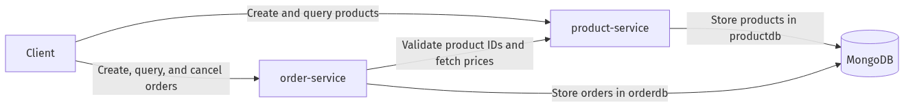

# Order Management System

A Spring Boot microservices project for managing products and orders with MongoDB. The system is split into two services that communicate over HTTP: `product-service` owns the product catalog, and `order-service` creates orders by validating product IDs against the product API.

This repository is organized as a multi-module Maven project, includes Docker support for the full stack, and provides a `Makefile` for the most common development tasks.

## Project Overview

The application is composed of three runtime pieces:

- `product-service` exposes CRUD, filtering, and pagination endpoints for products
- `order-service` creates and manages orders using product data from `product-service`
- `mongo` provides persistence for both services, with each service using its own database

### Service Flow

1. A client creates products in `product-service`
2. A client sends product IDs to `order-service`
3. `order-service` calls `product-service` to validate each product and calculate the order total
4. The order is stored with status `CREATED`
5. Orders can later be queried or cancelled



### Project Structure

```text
.
├── product-service/        # Product catalog microservice
│   ├── src/main/java/.../controller/
│   ├── src/main/java/.../service/
│   ├── src/main/java/.../repository/
│   ├── src/main/java/.../dto/
│   ├── src/main/resources/application.properties
│   └── Dockerfile
├── order-service/          # Order management microservice
│   ├── src/main/java/.../controller/
│   ├── src/main/java/.../service/
│   ├── src/main/java/.../client/
│   ├── src/main/java/.../repository/
│   ├── src/main/java/.../dto/
│   ├── src/main/resources/application.properties
│   └── Dockerfile
├── docker-compose.yml      # MongoDB + both services
├── Makefile                # Common build, run, test, and Docker tasks
├── pom.xml                 # Root Maven aggregator
└── README.md               # This file
```

## Getting Started

### Prerequisites

- Java `21`
- Docker and Docker Compose
- A Unix-like shell for running `make`

### Run the Full Stack with Docker

From the repository root:

```bash
make docker-up
```

This command:

1. Packages `product-service`
2. Packages `order-service`
3. Starts MongoDB
4. Starts both Spring Boot services in Docker

To stop everything:

```bash
make docker-down
```

To follow container logs:

```bash
make docker-logs
```

### Run the Services Locally

If you want to run the APIs outside Docker, start MongoDB first and then launch each service in a separate terminal.

Build all modules:

```bash
make build-all
```

Run the product API:

```bash
make product-api
```

Run the order API:

```bash
make order-api
```

By default, local execution expects:

- MongoDB on `localhost:27017`
- `product-service` on `http://localhost:8081`
- `order-service` on `http://localhost:8082`

### IntelliJ IDEA

Open the repository root instead of importing each service separately.

1. Choose `File` -> `Open`
2. Select the `order-management-system` directory
3. Import the root `pom.xml` as a Maven project

Recommended settings:

- JDK: `21`
- Maven import: enabled
- Annotation processing: enabled

The root aggregator should expose both Maven modules in the same workspace:

- `product-service`
- `order-service`

## Available Commands

| Command | Description |
|---------|-------------|
| `make build-all` | Build all Maven submodules from the repository root |
| `make product-build` | Compile `product-service` |
| `make product-api` | Run `product-service` locally |
| `make product-test` | Run `product-service` tests |
| `make product-package` | Package `product-service` |
| `make order-build` | Compile `order-service` |
| `make order-api` | Run `order-service` locally |
| `make order-test` | Run `order-service` tests |
| `make order-package` | Package `order-service` |
| `make docker-package` | Build both JARs for Docker |
| `make docker-up` | Package both services and start the Docker stack |
| `make docker-down` | Stop the Docker stack |
| `make docker-logs` | Follow Docker Compose logs |

## Runtime Configuration

### Ports

- MongoDB: `27017`
- `product-service`: `8081`
- `order-service`: `8082`

### Default Properties

`product-service`:

- `spring.mongodb.host=${MONGODB_HOST:localhost}`
- `spring.mongodb.port=${MONGODB_PORT:27017}`
- `spring.mongodb.database=productdb`

`order-service`:

- `spring.mongodb.host=${MONGODB_HOST:localhost}`
- `spring.mongodb.port=${MONGODB_PORT:27017}`
- `spring.mongodb.database=orderdb`
- `product.service.url=${PRODUCT_SERVICE_URL:http://localhost:8081}`

In Docker, these values are injected through `docker-compose.yml`, including the internal service-to-service URL `http://product-service:8081`.

## API Overview

### Product Service

Base URL: `http://localhost:8081/products`

Main endpoints:

- `POST /products` create a product
- `GET /products` list all products
- `GET /products/{id}` get one product
- `PUT /products/{id}` update a product
- `DELETE /products/{id}` delete a product
- `GET /products/category/{category}` filter by category
- `GET /products/active` list active products
- `GET /products/search?category=...&active=...` search by filters
- `GET /products/paged?page=0&size=10&sortBy=name&direction=asc` paginated listing

Example request:

```bash
curl -X POST http://localhost:8081/products \
  -H "Content-Type: application/json" \
  -d '{
    "name": "Wireless Mouse",
    "description": "Bluetooth mouse",
    "price": 29.99,
    "category": "electronics",
    "stock": 100
  }'
```

Product responses include:

- `id`
- `name`
- `description`
- `price`
- `category`
- `stock`
- `active`

### Order Service

Base URL: `http://localhost:8082/orders`

Main endpoints:

- `POST /orders` create an order from product IDs
- `GET /orders` list all orders
- `GET /orders/{id}` get one order
- `PATCH /orders/{id}/cancel` cancel an order

Example request:

```bash
curl -X POST http://localhost:8082/orders \
  -H "Content-Type: application/json" \
  -d '{
    "productIds": ["PRODUCT_ID_1", "PRODUCT_ID_2"]
  }'
```

Order responses include:

- `id`
- `productIds`
- `totalAmount`
- `status`

### Example Workflow

1. Create one or more products through `product-service`
2. Copy the returned product IDs
3. Create an order in `order-service` with those IDs
4. Fetch the order with `GET /orders/{id}`
5. Cancel it with `PATCH /orders/{id}/cancel` if needed

## Module Notes

### `product-service`

Responsibilities:

- Product creation and updates
- Basic product lifecycle management
- Category and active-state filtering
- Pagination and sorting

Data model:

- `id`
- `name`
- `description`
- `price`
- `category`
- `stock`
- `active`

### `order-service`

Responsibilities:

- Order creation
- Total amount calculation
- Product validation through inter-service HTTP calls
- Order retrieval and cancellation

Business rules currently enforced:

- Orders require a non-empty list of product IDs
- Every referenced product must exist
- Inactive products cannot be ordered
- Cancelling an already cancelled order raises an error

## Testing

Run the test suites with:

```bash
make product-test
make order-test
```

Both commands currently pass in this repository.

## Troubleshooting

### Docker stack does not start

- Check Docker is running
- Verify ports `27017`, `8081`, and `8082` are free
- Inspect logs with `make docker-logs`

### Order creation fails

- Confirm the product IDs exist in `product-service`
- Confirm the products are still marked as active
- Confirm `order-service` can reach `product-service`

### Local startup issues

- Verify Java `21` is installed
- Verify MongoDB is reachable on `localhost:27017`
- Rebuild with `make build-all`

## Technology Stack

| Component | Technology |
|-----------|------------|
| Language | Java 21 |
| Framework | Spring Boot 4 |
| Product persistence | Spring Data MongoDB |
| Order HTTP client | Spring WebFlux `WebClient` |
| Validation | Jakarta Validation |
| Build tool | Maven Wrapper |
| Orchestration | Docker Compose |
| Task runner | Make |
